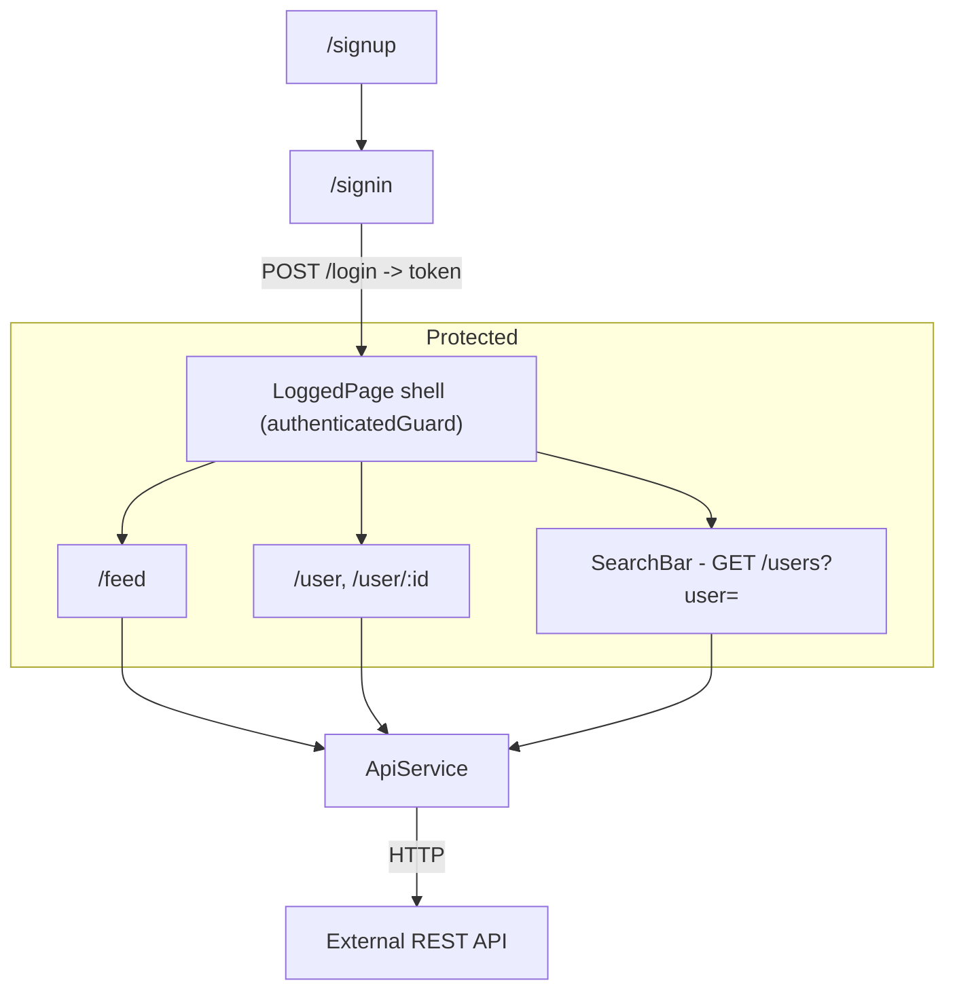

# BlueWave

Hybrid mobile/web frontend for a simple social network, built with Angular 19, Ionic 8 and Capacitor 7. The interface is in Brazilian Portuguese. It was developed as a university course project; `docs/draft.md` contains the assignment requirements and the checklist of implemented items.

The repository contains only the frontend. The backend is a separate HTTP service that is not part of this repository.

## Overview

The app provides a minimal social network experience: users register and log in, publish text posts, like posts, follow other users, search for users by name and view profiles. The frontend consumes a REST API through a single `ApiService`; authentication is token-based (bearer token stored in `localStorage`).

Main flow:

```
/signup -> /signin -> (token stored) -> protected area
  - /feed        post feed
  - /user        current user profile
  - /user/:userID   other users' profiles
```

## Architecture

Pages are lazy-loaded modules (`PreloadAllModules`). The empty root path loads a `LoggedPage` shell that is guarded by `authenticatedGuard`: without a token it redirects to `/signin`. The shell renders the `search-bar` header, a `router-outlet` and a bottom navigation.



HTTP goes through two interceptors registered in `AppModule`:

- `authInterceptor` attaches `Authorization: Bearer <token>` to every request except `POST /users` and `POST /login`, and redirects to `/signin` when the API answers with `"Token is expired"`.
- `loggerInterceptor` logs each request to the console and adds a random delay of 0-999 ms to every response.

### API contract

Endpoints are inferred from `src/app/services/api/api.service.ts`:

| Method | Path | `ApiService` method | Purpose |
| ------ | ---- | ------------------- | ------- |
| POST | `/users` | `createUser` | Create account |
| POST | `/login` | `loginUser` | Login; returns the raw token string |
| DELETE | `/users/{id}` | `deleteAccount` | Delete account |
| GET | `/users/{id}` | `getUser` | Fetch a profile |
| GET | `/users?user=` | `searchUsers` | Search users by name/nick |
| POST | `/users/{id}/follow` | `followUser` | Follow a user |
| POST | `/users/{id}/unfollow` | `unfollowUser` | Unfollow a user |
| GET | `/posts` | `getPosts` | List posts |
| POST | `/posts` | `createPost` | Create a post |
| POST | `/posts/{id}/like` | `likePost` | Like a post |

The response payloads are typed by the interfaces in `src/app/models/` (`User`, `Post`, `TokenData`). The `TokenData` model is currently unused; `loginUser` is typed as returning a plain string.

## Requirements

- Node.js and npm (the repository does not pin a Node version; the toolchain uses Angular CLI `19.2.11` from `package.json`).
- Google Chrome, required by Karma for `npm test`.

## Installation

```sh
npm install
```

## Configuration

The API base URL is defined as `API_URL` in:

- `src/environments/environment.ts` (dev)
- `src/environments/environment.prod.ts` (replaced during production builds, see `fileReplacements` in `angular.json`)

Both currently point to `https://gabriel.tailb6a2e.ts.net/api`, a Tailscale tunnel URL with commented-out `localhost` alternatives. Edit these files to point at your backend before running the app. There is no `.env` file and no environment variable loading at runtime.

## Usage

Run the development server:

```sh
npm run dev
```

`npm run dev` runs `ng serve` (Angular dev server, default `http://localhost:4200`). The app needs a running backend at the configured `API_URL`; without one, login/registration and feed requests fail.

Routes (see `src/app/app-routing.module.ts`):

- `/home` - leftover Ionic starter page, not part of the main flow
- `/signup` - registration
- `/signin` - login
- `/feed` - post feed (protected)
- `/user` - current user profile (protected)
- `/user/:userID` - another user's profile (protected)
- any other path redirects to `/feed`

## Development

```sh
npm run build    # production build
npm run watch    # rebuild on changes (development config)
```

The production build writes to `../bluewave` (a sibling directory outside this repository), as configured by `outputPath` in `angular.json`.

Capacitor is configured in `capacitor.config.ts` (`appId: com.andradeatdev.bluewave`, `webDir: www`). No native platform has been added to the repository, so there are no `ios/` or `android/` directories to build.

## Tests

Unit tests run with Karma and Jasmine:

```sh
npm test
```

`karma.conf.js` uses the `Chrome` browser in watch mode. A `ci` configuration is available in `angular.json` (`ng test --configuration ci`) that disables watch mode and progress output. The existing specs cover pages, components, services, pipes, directives and guards, but are currently minimal "should create" smoke tests.

## Quality

```sh
npm run lint
```

Runs ESLint with the `@angular-eslint` rules defined in `.eslintrc.json`. A Biome configuration (`biome.json`, v1.9.4) also exists but has no npm script wired to it.

## Project structure

```
src/app/
  components/     Reusable UI pieces
    create-post-card/   Post composer form (feed)
    post-card/          Single post (title, body, like button, date)
    post-card-skeleton/ Loading placeholder for posts
    profile-card/       Profile header (stats, follow, logout, delete account)
    profile-card-skeleton/ Loading placeholder for profiles
    search-bar/         User search with results dropdown
  directives/
    expand-onclick/     Custom directive: expands truncated post body on click
  guards/
    authenticated.guard.ts  Redirects unauthenticated users to /signin
  interceptors/
    auth.ts             Adds bearer token; handles expired sessions
    logger.ts           Console logs and delays responses
  models/             TypeScript interfaces for User, Post, TokenData
  pages/              Lazy-loaded routed pages (home, signup, signin, logged, feed, user)
  pipes/
    nick/               Custom pipe: prefixes a nick with "@"
    post-date/          Custom pipe: formats a date as "HH:mm:ss - dd Mon, yyyy"
  services/
    api/                Single HttpClient wrapper with all API calls
    auth/               Token storage (localStorage)
    post/               Post operations
    user/               User operations (login, follow, search, delete)
    toast/              Ionic toast notifications
  validators/
    signup.ts           Custom form validator for password confirmation
```

Custom pipes (`nick`, `postDate`), the built-in `uppercase` pipe (used on the signup page), the `expandOnclick` directive and the `validateSignUp` validator are the pieces required by the course assignment.

## Limitations and decisions

Observed behavior worth knowing:

- The backend is not included. The `API_URL` is hardcoded in the environment files and currently points to a Tailscale tunnel; the commented-out `localhost` entries suggest local development is expected.
- The `postCreated` output of `create-post-card` is declared and bound in the feed template, but the component never emits it, so a newly created post is not prepended to the feed until the page reloads.
- The feed's empty state (`*ngIf="!isLoading && !posts"`) can never render, because `posts` is initialized to an empty array, which is truthy.
- The build output path (`../bluewave`) does not match Capacitor's `webDir` (`www`), so `npx cap sync` would not pick up the Angular build output as configured.
- The authentication token lives in `localStorage` with no client-side expiry; an expired session is only detected when the API returns `"Token is expired"`.
- `loggerInterceptor` intentionally slows down every response with a random 0-999 ms delay and logs requests to the console.
- Formatting is inconsistent across the repo: `.editorconfig` prescribes spaces (4), `biome.json` prescribes tabs (4), and the source files mix both.
- `home` page and `TokenData` model are unused leftovers; `Renderer2` is injected but unused in `expand-onclick.directive.ts`.

## License

No license file is present in the repository. The `package.json` scaffold metadata (`author`, `homepage`) is the default Ionic Framework boilerplate.
